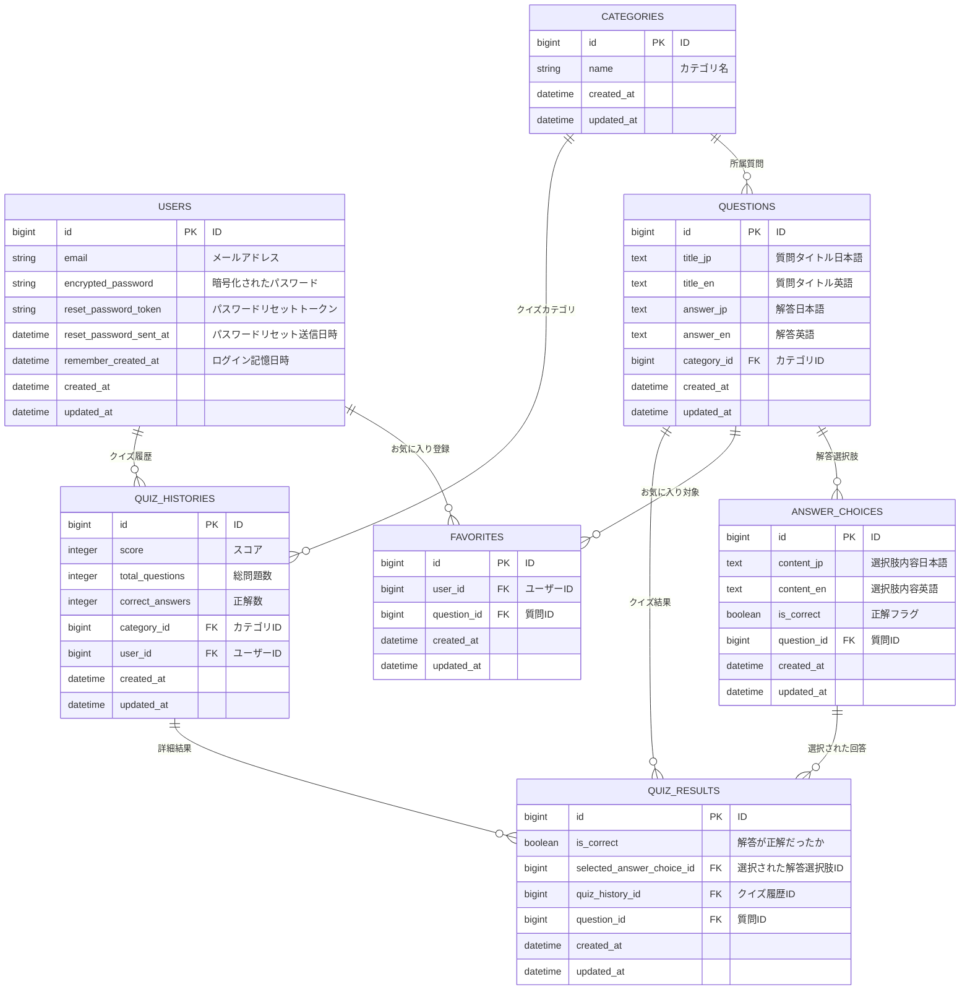

# ✈️ ClearGate - 税関英語対策アプリ

## ■ サービス概要

**ClearGate** は、初めて海外旅行に行く20代の日本人の若者や学生が、税関での英語対応に不安を感じたときに、事前に「よく聞かれる質問」とその「模範回答」を学習・確認できるアプリです。

- 税関の受け答えに特化
- クイズ形式・音声再生で実践的な英語練習（音声は本リリースで導入）
- シンプル＆広告なしでストレスフリーなUX

アプリ名は、「Clear（通過する）」＋「Gate（入国ゲート）」から命名しました。

---

## ■ ターゲット層とその根拠

本アプリは、**初めて海外旅行に行く20代の日本人の若者や学生**を主なターゲットとしています。

- Skyscannerの調査によると、18～25歳の回答者の61％が、両親や保護者なしで初めて海外旅行を経験し、そのうち69％が19～21歳の間に初渡航しているという結果が出ています。
- つまり、多くの20代前半が初めて単独で海外へ行っており、英語のやり取りに不安や緊張を感じやすい層だと言えます。

この背景から、「英語での税関対応に不安を感じる20代初海外旅行者」は非常に多く存在すると考え、本アプリはそういった層へ向けた**安心サポートツール**として開発されました。

---

## ■ 開発背景

私は現在20代で、これまで海外に行ったことがありません。

正直、空港の手続きや税関での英語対応に対して、漠然とした不安を感じていました。

特に英語に自信がない私にとっては、

「何を聞かれるのか分からない」「うまく答えられなかったらどうしよう」といった不安が、

旅のワクワクよりも先に頭に浮かんでしまいます。

そんな中、同じ20代の友人たちから、

「税関でいきなり英語で話しかけられて焦った」

「英語が聞き取れなくて何度も聞き返された」

といった体験談を聞く機会が増え、**「自分も同じように困るだろうな」**と強く感じました。

だったら、事前に**「よくある質問と模範回答」**を確認できるアプリがあれば、

初めての海外旅行でも英語に構えすぎず、自信を持って税関を通過できるのではないか。

そんな思いから、自分自身の不安を出発点にこのアプリを企画・開発しました。

このアプリは、私と同じように

「英語に不安を感じる初海外旅行者」が、

英語の壁を少しでも乗り越えて、旅そのものを楽しめるようになるきっかけになればと願っています。

---

## ■ 類似サービスとの差別化ポイント

| 類似サービス | 特徴 | ClearGateの差別化 |
| --- | --- | --- |
| Excuse Me – English | 多言語対応・旅行フレーズ集 | 税関のような具体的な受け答え練習には不向き |
| 旅行英会話 | 広範な旅行シーン対応・クイズ機能あり | 広告が多く、UXに課題 |

> ClearGateの強み：
>
> - 税関でのやり取りに特化した構成
> - 模範回答の音声再生機能（本リリース予定）
> - クイズ形式による実践的学習
> - 広告なし＆シンプルUIでストレスフリー

---

## ■ ユーザー獲得戦略

- **SNS（X/Instagram）での発信**
    - `#旅行英語 #空港英語 #初めての海外旅行 #ClearGate` などのハッシュタグ活用
- **季節イベントに合わせた発信**
    - GW・夏休み・卒業旅行などの旅行シーズン前に診断・クイズなどを発信
- **投稿の反応分析と改善**
    - 「いいね数」「シェア数」「保存数」などを分析し、投稿内容を最適化

---

## ■ MVP（最小限の機能）

- ユーザー登録機能 ※Devise などを使ったメール／パスワード認証
- ログイン・ログアウト機能
- パスワードリセット機能
    - パスワードリセットメール送信ページ
    - 新しいパスワード入力ページ
- メールアドレス変更機能
    - メールアドレス変更申請ページ
    - メールアドレス変更確認ページ
- お気に入り登録（ユーザーごとに好きな質問をマーク）
- 質問作成（seedによる初期データ登録）
- 質問一覧表示（カテゴリ別 / 一覧形式）
- 質問詳細表示（英文 + 和訳 + 模範回答）
- カテゴリ分類
- クイズ機能（JSによる模範回答の出し分け）
- 質問検索機能（ransack使用）
- レスポンシブ対応（Tailwind CSS）
- 過去のクイズ履歴一覧表示（実施日時 + カテゴリのみ）
- 過去のクイズ履歴詳細ページ
  - 正解数（score）
  - 各設問の正誤
  - 「解説を見る」リンクで該当質問の解説ページへ遷移

---

## ■ 実装方針（MVP）

- `db/seeds.rb` を用いて、カテゴリ付き英日Q&Aを一括登録（約50問）
- `Category` モデルと `Question` モデルを `has_many / belongs_to` で紐付け
- `ransack` を利用し、日本語・英語キーワードによる曖昧検索を実装
- クイズは質問のみを表示 → 「模範回答を表示」ボタンで回答欄が出現（JavaScript制御）
- UIは Tailwind CSS を使用し、スマホ対応も意識したレスポンシブデザインを実装
- `devise` を導入し、`User` モデルで新規登録／ログイン／ログアウト機能を実装
- `devise` のパスワードリセット機能を利用し、メール認証フローでのメールアドレス・パスワード変更を実装
- `Favorite` モデル（`user_id`, `question_id`）を用意し、ログインユーザーが質問をお気に入り登録／解除できる機能を実装
- **`QuizHistory` モデルと `QuizResult` モデルを作成し、クイズ実行時に以下を保存**
  - **`QuizHistory` には `created_at`（実施日時）、`user_id`、`category_id`（カテゴリ）、`score`（正解数）を保存**
  - **`QuizResult` には `quiz_history_id`、`question_id`、`correct`（正誤判定）を保存**
- マイページに「過去のクイズ履歴一覧ページ」を設置
  - **`current_user.quiz_histories` を日付降順で取得し、「実施日時」「カテゴリ」「正解数（スコア）」をテーブル表示**
- クイズ履歴詳細ページを実装
  - **対象の `QuizHistory` とそれに紐づく `QuizResult`s を読み出し表示**
  - **各設問（`QuizResult`に紐づく`Question`）について、問題文、和訳、模範回答、ユーザーの正誤を表示**
  - 各設問に「解説を見る」リンクを配置し、`/questions/:id#explanation` 等で解説セクションへ遷移

---

## ■ 本リリースで追加予定の機能

- **管理画面による質問・カテゴリのCRUD操作**（ActiveAdmin）
- **模範英文の音声再生機能**（Google Cloud TTS API）
- **使用履歴表示機能**（セッションベース）
※MVP後のユーザーの反応を見て導入を判断

---

## ■ 実装方針（本リリース）

- ActiveAdminで管理画面を構築し、カテゴリ・質問の追加/編集/削除を可能にする
- Google Cloud Text-to-Speech API を使い、英文を音声データに変換し、HTML5 `<audio>` タグで再生
- お気に入り・使用履歴はセッションに保存し、ユーザーの学習履歴や好みに応じた質問の再確認を可能にする

---

## **■ アプリの方向性**

ClearGateは今後も「初めての海外旅行でも安心して使える」ことを軸に、以下のような機能の拡張を検討しています。

- 税関の質問に対する模擬英会話（AIとの会話形式）　実際の会話の流れに慣れることで、本番でも落ち着いて対応できる力を身につけられるようにします。
- PWA対応によるオフライン利用　出国直前や飛行機内、現地の通信環境が不安定な場面でも、質問と回答をスムーズに確認できるようにします。

また、ユーザーの反応を見ながら、税関だけでなく以下のような空港シーンへの対応も柔軟に検討していく予定です。

- 出国手続きや入国カードの記入　実際に記入する英語表現や内容を事前に確認できることで、空港での不安を軽減します。
- ホテルのチェックインや交通機関でのやり取り　現地での生活に直結するやり取りにも対応できるよう、実践的なフレーズやシーン別QAを拡張していく予定です。
---

## ■ 技術スタック

| 区分 | 使用技術 |
| --- | --- |
| フレームワーク | Ruby on Rails 7.1.3 |
| デプロイ | Render |
| データベース | PostgreSQL |
| CSSフレームワーク | Tailwind CSS |
| 検索 | ransack |
| 管理画面 | ActiveAdmin（予定） |
| 音声生成 | Google Cloud TTS API（予定） |

---

## ■ キャッチアップ中の技術

- seedファイルでのカテゴリ連携と大量データの扱い方（未）
- Google Cloud API認証と音声データ生成処理（未）
- JavaScriptによる表示制御（Stimulusも視野）（未）
- devise によるユーザー登録／ログイン／ログアウト機能の検証（未）
- devise のメール認証フロー（パスワードリセット）によるメールアドレス／パスワード変更機能の検証（未）

AIを用いて技術の検証を行なってから、実装に加える予定

---

## ■ 今後の拡張機能（予定）

- PWA 対応（オフラインキャッシュ／Service Worker / manifest.json）

---

## ■ 画面遷移図
https://www.figma.com/design/lB2xtaGdEbdXdZbgvTkG29/Clear-Gate%E7%94%BB%E9%9D%A2%E9%81%B7%E7%A7%BB%E5%9B%B3?node-id=57-312&t=nVP7BJXdwYnuL6ib-1

---

## ■ ER図

